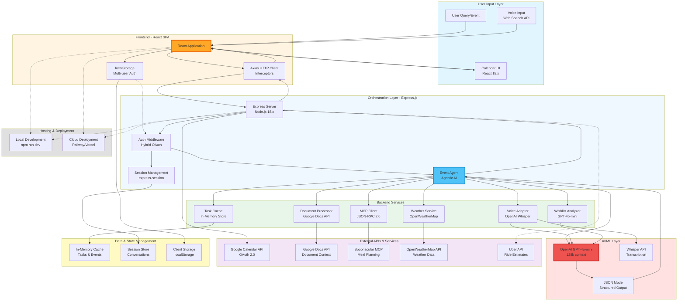
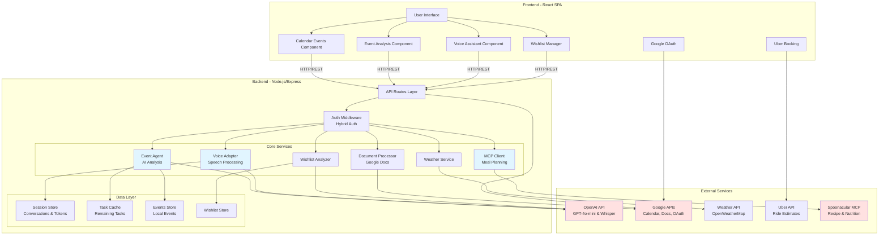
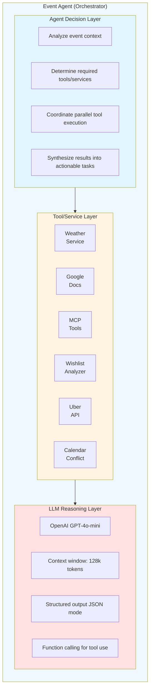
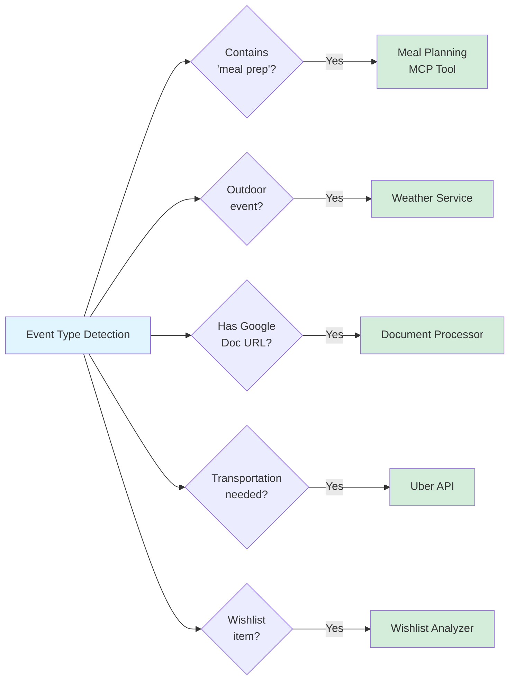
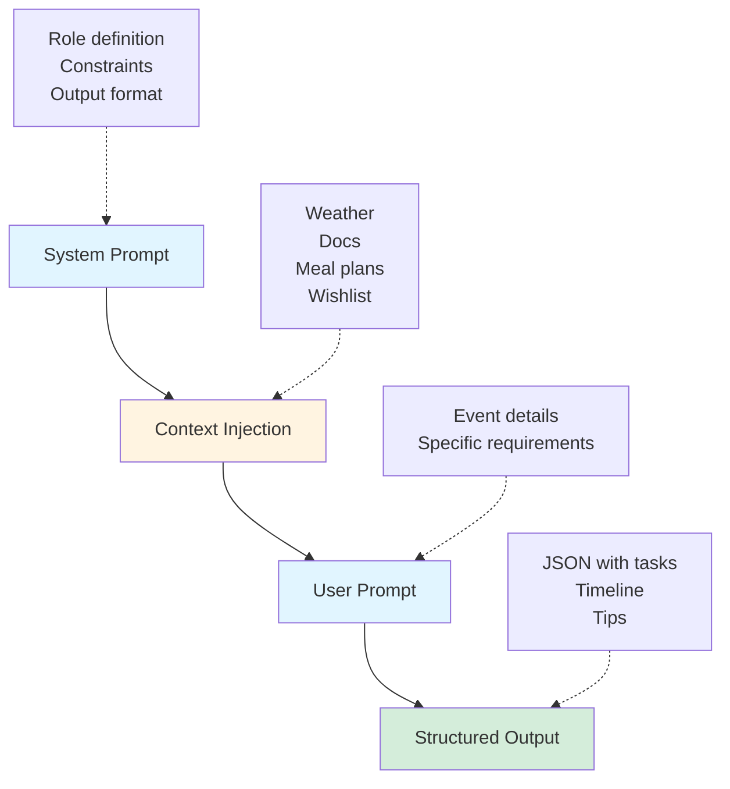
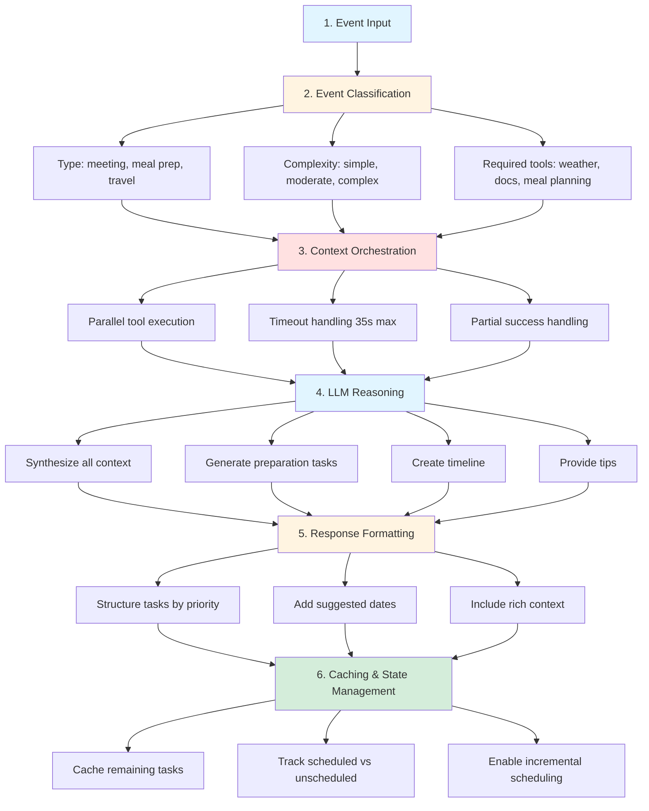
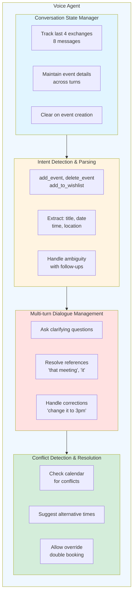

# Calendar AI Agent - Architecture Documentation

## Table of Contents
1. [Project Overview](#project-overview)
2. [Technology Stack](#technology-stack)
3. [System Architecture](#system-architecture)
4. [Agent Architecture](#agent-architecture)
5. [MCP Integration](#mcp-integration)
6. [Core Components](#core-components)
7. [Data Flow](#data-flow)
8. [AI/ML Integration](#aiml-integration)
9. [API Design](#api-design)
10. [Security & Authentication](#security--authentication)
11. [Deployment Architecture](#deployment-architecture)

---

## Project Overview

### Purpose
Calendar AI Agent is an intelligent calendar management system that uses AI to analyze events, generate preparation checklists, create meal plans, and provide voice-based interaction. It helps users manage their schedules more effectively by automating task breakdown, suggesting optimal timing, and integrating with external services.

### Key Features
- **AI Event Analysis**: Automatically generates preparation tasks for events
- **Voice Assistant**: Natural language event creation and management
- **Meal Planning**: AI-powered meal plan generation for meal prep events
- **Smart Scheduling**: Conflict detection and alternative time suggestions
- **Wishlist Management**: Track and schedule future activities
- **Weather Integration**: Weather-aware event suggestions
- **Uber Integration**: Transportation booking for events
- **Google Calendar Sync**: Two-way sync with Google Calendar

### Why This Project?
- **Problem**: Managing complex events requires manual task breakdown and planning
- **Solution**: AI automates preparation task generation, saving time and reducing cognitive load
- **Value**: Users can focus on execution rather than planning

---

## Technology Stack

### Frontend
| Technology | Version | Purpose | Why Chosen |
|------------|---------|---------|------------|
| **React** | 18.x | UI Framework | Component-based, large ecosystem, excellent for complex UIs |
| **Axios** | 1.x | HTTP Client | Promise-based, interceptor support, better error handling than fetch |
| **CSS3** | - | Styling | Custom styling for full design control, no framework overhead |
| **Web Speech API** | - | Voice Input | Native browser API, no external dependencies |

**Why React?**
- Component reusability (EventAnalysis, VoiceAssistant, CalendarEvents)
- State management with hooks (useState, useCallback, useRef)
- Fast rendering for real-time updates
- Large community and tooling support

### Backend
| Technology | Version | Purpose | Why Chosen |
|------------|---------|---------|------------|
| **Node.js** | 18.x+ | Runtime | JavaScript everywhere, async I/O, npm ecosystem |
| **Express.js** | 4.x | Web Framework | Lightweight, flexible, middleware-based architecture |
| **express-session** | 1.x | Session Management | Server-side sessions for OAuth tokens and conversation state |
| **cookie-parser** | 1.x | Cookie Handling | Parse cookies for session management |
| **dotenv** | 16.x | Environment Config | Secure API key management |

**Why Node.js + Express?**
- Full-stack JavaScript (same language as frontend)
- Non-blocking I/O perfect for API-heavy application
- Easy integration with AI services (OpenAI, Google APIs)
- Fast development with npm packages

### AI & Machine Learning
| Service | Purpose | Why Chosen |
|---------|---------|------------|
| **OpenAI GPT-4o-mini** | Event analysis, task generation, voice parsing, all AI features | Cost-effective, fast, reliable JSON output, 128k context window |
| **Whisper API** | Voice transcription | Best-in-class accuracy, multilingual support |
| **Spoonacular API** | Recipe and meal data | Comprehensive recipe database with nutrition info |

**Why OpenAI?**
- Superior natural language understanding
- Structured output support (JSON mode)
- Function calling for tool use
- Reliable and well-documented API

**Why Spoonacular?**
- 365,000+ recipes with detailed nutrition data
- Meal planning API with dietary restrictions
- Recipe images and instructions
- Active development and support

### External APIs & Services
| Service | Purpose | Why Chosen |
|---------|---------|------------|
| **Google Calendar API** | Calendar sync | Industry standard, OAuth 2.0, reliable |
| **Google Docs API** | Document reading | Read meeting agendas, extract context |
| **OpenWeatherMap API** | Weather data | Free tier, accurate forecasts, global coverage |
| **Uber API** | Ride booking | Direct integration, no third-party apps needed |

### Development Tools
| Tool | Purpose |
|------|---------|
| **npm** | Package management |
| **nodemon** | Auto-restart on file changes |
| **dotenv** | Environment variable management |
| **Git** | Version control |

### Tech Stack Architecture Diagram



---

## System Architecture

### High-Level Architecture

```
┌─────────────────────────────────────────────────────────────┐
│                         Frontend (React)                     │
│  ┌──────────────┐  ┌──────────────┐  ┌──────────────┐     │
│  │ Calendar     │  │ Event        │  │ Voice        │     │
│  │ Events       │  │ Analysis     │  │ Assistant    │     │
│  └──────────────┘  └──────────────┘  └──────────────┘     │
│                                                              │
│  ┌──────────────┐  ┌──────────────┐  ┌──────────────┐     │
│  │ Wishlist     │  │ Uber         │  │ Google       │     │
│  │ Manager      │  │ Booking      │  │ Auth         │     │
│  └──────────────┘  └──────────────┘  └──────────────┘     │
└─────────────────────────────────────────────────────────────┘
                            ↕ HTTP/REST
┌─────────────────────────────────────────────────────────────┐
│                    Backend (Node.js/Express)                 │
│  ┌──────────────────────────────────────────────────────┐  │
│  │                    API Routes                         │  │
│  │  /api/analyze-event  /api/voice/*  /api/calendar/*  │  │
│  └──────────────────────────────────────────────────────┘  │
│                            ↕                                 │
│  ┌──────────────────────────────────────────────────────┐  │
│  │                  Core Services                        │  │
│  │  • EventAgent (AI Analysis)                          │  │
│  │  • VoiceAdapter (Speech Processing)                  │  │
│  │  • MCP Meal Planning Client                          │  │
│  │  • Document Processor                                │  │
│  │  • Weather Service                                   │  │
│  └──────────────────────────────────────────────────────┘  │
│                            ↕                                 │
│  ┌──────────────────────────────────────────────────────┐  │
│  │                  Data Layer                           │  │
│  │  • Session Store (Conversations, Tokens)             │  │
│  │  • Task Cache (Remaining Tasks)                      │  │
│  │  • Events Store (Local Events)                       │  │
│  │  • Wishlist Store (User Wishlist)                    │  │
│  └──────────────────────────────────────────────────────┘  │
└─────────────────────────────────────────────────────────────┘
                            ↕ API Calls
┌─────────────────────────────────────────────────────────────┐
│                    External Services                         │
│  ┌──────────┐  ┌──────────┐  ┌──────────┐  ┌──────────┐   │
│  │ OpenAI   │  │ Google   │  │ Weather  │  │ Uber     │   │
│  │ API      │  │ APIs     │  │ API      │  │ API      │   │
│  └──────────┘  └──────────┘  └──────────┘  └──────────┘   │
│  ┌──────────┐                                               │
│  │Spoonacular│                                              │
│  │   MCP    │                                               │
│  └──────────┘                                               │
└─────────────────────────────────────────────────────────────┘
```

### High-Level Architecture (Mermaid Diagram)



### Component Architecture

#### Frontend Components
```
src/
├── components/
│   ├── CalendarEvents.js       # Main calendar view, event list
│   ├── EventAnalysis.js        # AI analysis display, task management
│   ├── EventDetails.js         # Event detail modal
│   ├── VoiceAssistant.js       # Voice input/output interface
│   ├── Wishlist.js             # Wishlist management
│   ├── UberBooking.js          # Uber ride booking modal
│   └── GoogleAuth.js           # Google OAuth flow
├── App.js                      # Root component, routing
└── index.js                    # Entry point
```

#### Backend Services
```
server/
├── routes/
│   ├── googleCalendar.js       # Google Calendar integration
│   ├── voice.js                # Voice processing endpoints
│   ├── uber.js                 # Uber API integration
│   └── wishlist.js             # Wishlist CRUD operations
├── services/
│   ├── eventAgent.js           # AI event analysis orchestrator
│   ├── eventAnalyzer.js        # Event analysis coordinator
│   ├── mcpMealPlanningClient.js # Spoonacular MCP integration
│   ├── documentProcessor.js    # Google Docs reading
│   ├── weatherService.js       # Weather API integration
│   ├── taskCache.js            # Task state management
│   ├── eventsStore.js          # Local event storage
│   ├── wishlistStore.js        # Wishlist storage
│   └── voice/
│       ├── OpenAIVoiceAdapter.js    # OpenAI voice processing
│       ├── transcriptionService.js  # Whisper integration
│       └── VoiceAdapterFactory.js   # Adapter pattern
└── server.js                   # Express app entry point
```

---

## Agent Architecture

### Overview
The Calendar AI Agent follows an **agentic architecture** where the AI system acts autonomously to analyze events, generate tasks, and coordinate with external tools and services. The agent uses **tool calling** and **context orchestration** to provide intelligent assistance.

### Agent Design Pattern



### Agent Capabilities

#### 1. Context Gathering (Parallel Execution)
The agent automatically gathers relevant context for each event:

```javascript
// Parallel context gathering
const [weatherData, documentContext, mealPlanResult] = await Promise.all([
  fetchWeatherContext(event),      // Weather for outdoor events
  fetchDocumentContext(event),      // Google Docs in description
  prepareMealPlanContext(event)     // Meal plans for meal prep
]);
```

**Why Parallel?**
- Faster response times (2-3s vs 6-8s sequential)
- Better user experience
- Efficient resource utilization

#### 2. Tool Selection & Orchestration
The agent decides which tools to use based on event characteristics:



#### 3. Reasoning & Task Generation
The agent uses LLM reasoning to:
- Break down complex events into 4-6 preparation tasks
- Suggest optimal timing for each task
- Prioritize tasks (High/Medium/Low)
- Generate 4-5 contextual tips
- Create timeline with milestones

**Prompt Structure**:



#### 4. Adaptive Behavior
The agent adapts based on:
- **Event type**: Different strategies for meetings vs meal prep vs travel
- **Available context**: Uses what's available, gracefully handles missing data
- **User history**: Learns from conversation history (voice assistant)
- **Failures**: Fallback mechanisms (LLM meal plans if Spoonacular fails)

### Agent Workflow



### Voice Agent Architecture

The voice assistant is a specialized agent with conversation memory:



**Key Design Decisions**:
- **4 exchanges**: Optimal balance between context and token cost
- **Session-based**: Privacy-friendly, no persistent storage
- **Clear on success**: Fresh start for next event
- **Reference resolution**: LLM uses history to understand "it", "that"

---

## MCP Integration

### What is MCP?

**Model Context Protocol (MCP)** is an open protocol that enables AI systems to securely connect to external data sources and tools. It provides a standardized way for LLMs to interact with external services.

**Key Concepts**:
- **MCP Server**: Exposes tools/resources via JSON-RPC 2.0
- **MCP Client**: Connects to servers and calls tools
- **Tools**: Functions the LLM can invoke (e.g., search recipes, get nutrition)
- **Resources**: Data sources the LLM can read (e.g., documents, databases)

### Why MCP?

| Benefit | Description |
|---------|-------------|
| **Standardization** | Common protocol across different AI systems |
| **Security** | Controlled access to external services |
| **Composability** | Mix and match different MCP servers |
| **Maintainability** | Update tools without changing AI code |

### MCP Architecture in This Project

```
┌─────────────────────────────────────────────────────────────┐
│                    Event Agent (Client)                      │
│                                                              │
│  ┌────────────────────────────────────────────────────┐    │
│  │         MCP Meal Planning Client                    │    │
│  │  • Spawns spoonacular-mcp process                  │    │
│  │  • Sends JSON-RPC 2.0 requests                     │    │
│  │  • Parses structured responses                     │    │
│  │  • Handles errors & fallbacks                      │    │
│  └────────────────────────────────────────────────────┘    │
│                          ↓ stdin/stdout                      │
└─────────────────────────────────────────────────────────────┘
                           ↓
┌─────────────────────────────────────────────────────────────┐
│              Spoonacular MCP Server (npm package)            │
│                                                              │
│  ┌────────────────────────────────────────────────────┐    │
│  │                 Available Tools                     │    │
│  │  • get_random_recipes(number, tags, diet)          │    │
│  │  • search_recipes(query, diet, intolerances)       │    │
│  │  • get_recipe_information(id, includeNutrition)    │    │
│  │  • analyze_recipe(ingredients, servings)           │    │
│  └────────────────────────────────────────────────────┘    │
│                          ↓                                   │
│  ┌────────────────────────────────────────────────────┐    │
│  │              Spoonacular API                        │    │
│  │  • 365,000+ recipes                                │    │
│  │  • Nutrition data                                  │    │
│  │  • Dietary restrictions                            │    │
│  │  • Recipe images                                   │    │
│  └────────────────────────────────────────────────────┘    │
└─────────────────────────────────────────────────────────────┘
```

### MCP Communication Flow

**JSON-RPC 2.0 Protocol**:

```javascript
// 1. Client sends request
{
  "jsonrpc": "2.0",
  "id": 1,
  "method": "tools/call",
  "params": {
    "name": "get_random_recipes",
    "arguments": {
      "number": 21,
      "tags": "vegetarian"
    }
  }
}

// 2. Server processes and responds
{
  "jsonrpc": "2.0",
  "id": 1,
  "result": {
    "content": [{
      "type": "text",
      "text": "{\"recipes\": [...]}"  // JSON string
    }],
    "isError": false
  }
}

// 3. Client parses result
const recipes = JSON.parse(result.content[0].text);
```

### MCP Client Implementation

**File**: `server/services/mcpMealPlanningClient.js`

**Key Methods**:
```javascript
class MCPMealPlanningClient {
  // Send JSON-RPC request to MCP server
  async sendMCPRequest(method, params) {
    const child = spawn('spoonacular-mcp', [], {
      stdio: ['pipe', 'pipe', 'pipe'],
      env: { SPOONACULAR_API_KEY: this.apiKey }
    });
    
    child.stdin.write(JSON.stringify(request) + '\n');
    // Parse response from stdout
  }
  
  // High-level tool wrappers
  async getRandomRecipes({ number, tags })
  async getRecipeInformation(id, includeNutrition)
  async searchRecipes({ query, diet, intolerances })
  
  // Meal plan generation
  async generateMealPlanForEvent(event, tokens, preferences)
}
```

### MCP vs Direct API Calls

| Aspect | MCP Approach | Direct API |
|--------|--------------|------------|
| **Abstraction** | High-level tools | Low-level HTTP |
| **Standardization** | JSON-RPC 2.0 protocol | Custom per API |
| **Composability** | Easy to add more MCP servers | Each API is different |
| **Maintenance** | Update MCP server independently | Update client code |
| **Error Handling** | Standardized error format | Custom per API |

**Why We Use MCP for Spoonacular**:
- ✅ Official npm package (`spoonacular-mcp`)
- ✅ Well-maintained and documented
- ✅ Handles API authentication
- ✅ Structured responses
- ✅ Easy to swap for other meal planning services

### MCP Error Handling & Fallbacks

```
1. Try MCP Server (Spoonacular)
   ├─ Success → Return structured meal plan
   ├─ API Quota Exceeded (402) → Fallback to LLM
   ├─ Network Error → Fallback to LLM
   └─ Parse Error → Fallback to LLM
   
2. Try LLM Fallback (GPT-4o-mini)
   ├─ Success → Return generated meal plan
   ├─ JSON Parse Error → Simple template
   └─ LLM Error → Simple template
   
3. Simple Template Fallback
   └─ Always succeeds → Basic meal suggestions
```

**Reliability**: 3-tier approach ensures users always get a meal plan

### Future MCP Integration Opportunities

**Potential MCP Servers to Add**:
- **Google Calendar MCP**: Standardized calendar operations
- **Weather MCP**: Weather data and forecasts
- **Transportation MCP**: Uber, Lyft, public transit
- **Document MCP**: Google Docs, Notion, Confluence
- **Task Management MCP**: Todoist, Asana, Trello

**Benefits of Adding More MCP Servers**:
- Consistent tool interface for the agent
- Easy to swap providers (e.g., Uber → Lyft)
- Community-maintained servers
- Reduced maintenance burden

---

## Core Components

### 1. Event Agent (AI Analysis Engine)

**File**: `server/services/eventAgent.js`

**Purpose**: Orchestrates AI-powered event analysis and task generation

**Key Responsibilities**:
- Analyze event details and generate preparation tasks
- Coordinate meal planning for meal prep events
- Integrate weather context
- Process Google Docs context
- Generate LLM fallback for meal plans

**Technology Choices**:
- **OpenAI GPT-4o-mini**: Complex reasoning for task breakdown
- **Structured Output**: JSON mode for reliable parsing
- **Context Window**: 128k tokens for rich context

**Why This Design?**
- Single responsibility: Event analysis
- Pluggable context sources (weather, docs, meal plans)
- Fallback mechanisms for reliability

### 2. Voice Assistant

**Files**: 
- `server/routes/voice.js`
- `server/services/voice/OpenAIVoiceAdapter.js`
- `client/src/components/VoiceAssistant.js`

**Purpose**: Natural language event creation and management

**Key Features**:
- **Conversation History**: Last 4 exchanges for context
- **Multi-turn Dialogues**: Build events over multiple interactions
- **Intent Detection**: Add, delete, wishlist operations
- **Conflict Resolution**: Detect and suggest alternatives

**Technology Choices**:
- **Whisper API**: Best-in-class transcription (96%+ accuracy)
- **GPT-4o-mini**: Fast, cost-effective intent parsing
- **Session-based Storage**: Conversation state in server sessions
- **Web Speech API**: Browser-native TTS for responses

**Why Conversation History?**
- Enables natural follow-ups ("change that to 3pm")
- Reduces user frustration (no need to repeat context)
- 4 exchanges = optimal balance (context vs token cost)
- Cleared after event creation = fresh start, no confusion

**Architecture Pattern**: Adapter Pattern
```javascript
VoiceAdapter (Interface)
    ↓
OpenAIVoiceAdapter (Implementation)
    ↓
parseIntent() → Extract event details
extractEventDetails() → Parse natural language
generateResponse() → Create user-friendly responses
```

### 3. Meal Planning System

**Files**:
- `server/services/mcpMealPlanningClient.js`
- `server/services/eventAgent.js` (fallback)

**Purpose**: Generate personalized meal plans for meal prep events

**Technology Choices**:
- **Primary**: Spoonacular MCP (npm package)
  - 365,000+ recipes
  - Nutrition data
  - Dietary restrictions
  - Recipe images
- **Fallback**: GPT-4o-mini
  - JSON mode for structured output
  - 4000 tokens for complete plans
  - Simple template fallback if JSON fails

**Why Two-Tier Approach?**
- **Spoonacular**: Rich data, real recipes, images
- **LLM Fallback**: Always works, no API quota issues
- **Template Fallback**: Last resort, always provides something

**Data Flow**:
```
1. Detect meal prep event
2. Show preferences modal (days, diet, calories)
3. Try Spoonacular MCP
4. If fails → Try LLM with preferences
5. If fails → Template meal plan
6. Display formatted plan
```

### 4. Google Calendar Integration

**File**: `server/routes/googleCalendar.js`

**Purpose**: Two-way sync with Google Calendar

**OAuth 2.0 Flow**:
```
1. User clicks "Connect Google"
2. Redirect to Google OAuth consent
3. User grants permissions
4. Receive authorization code
5. Exchange for access + refresh tokens
6. Store in server session
7. Use for API calls
```

**Scopes**:
- `calendar`: Read/write calendar events
- `drive.readonly`: Read Google Docs
- `userinfo.email`: User identification
- `userinfo.profile`: Display name

**Why Server-Side Tokens?**
- Security: Tokens never exposed to client
- Refresh: Automatic token refresh on expiry
- Session-based: Tied to user session

### 5. Document Processor

**File**: `server/services/documentProcessor.js`

**Purpose**: Extract context from Google Docs in event descriptions

**Use Cases**:
- Meeting agendas
- Project documents
- Shared notes

**Technology**:
- Google Docs API v1
- OAuth 2.0 authentication
- OpenAI for summarization (if doc > 2000 chars)

**Why This Feature?**
- Meetings often reference docs
- Auto-extract context saves time
- AI summarization for long docs

---

## Data Flow

### Event Analysis Flow

```
1. User clicks "Generate Checklist"
   ↓
2. Frontend: POST /api/analyze-event
   ↓
3. Server: eventAnalyzer.analyzeEvent()
   ↓
4. Parallel Context Gathering:
   ├─ Weather Service → Current conditions
   ├─ Document Processor → Google Docs content
   ├─ Meal Planning (if meal prep) → Recipes/plan
   └─ Event Details → Title, date, description
   ↓
5. EventAgent.analyzeEvent()
   ├─ Build rich prompt with all context
   ├─ Call OpenAI GPT-4o-mini
   └─ Parse structured JSON response
   ↓
6. Response Processing:
   ├─ Preparation tasks (4-6 items)
   ├─ Timeline suggestions
   ├─ Tips (4-5 items)
   ├─ Meal plan (if applicable)
   └─ Weather suggestions
   ↓
7. Cache tasks (for "remaining tasks" feature)
   ↓
8. Return to frontend
   ↓
9. Display in EventAnalysis component
```

### Voice Conversation Flow

```
1. User clicks microphone
   ↓
2. Browser: Record audio (Web Audio API)
   ↓
3. Frontend: POST /api/voice/transcribe
   ↓
4. Server: Whisper API transcription
   ↓
5. Frontend: POST /api/voice/process
   ├─ Load conversation history (last 4 exchanges)
   ├─ Build context (date, wishlist, existing events)
   └─ Call OpenAI with history + new transcript
   ↓
6. Intent Detection:
   ├─ add_event → Extract details
   ├─ delete_event → Identify event
   ├─ add_to_wishlist → Store for later
   ├─ needs_clarification → Ask follow-up
   └─ update_wishlist → Modify item
   ↓
7. Update Conversation:
   ├─ Add user message to history
   ├─ Add AI response to history
   ├─ Keep last 8 messages (4 exchanges)
   └─ Save to session
   ↓
8. If ready to create:
   ├─ Check conflicts
   ├─ Create event (Google or local)
   └─ Clear conversation history
   ↓
9. Return response + updated history
   ↓
10. Frontend: Display + speak response
```

### Meal Plan Generation Flow

```
1. Detect meal prep event (title/description contains "meal prep")
   ↓
2. Show preferences modal
   ├─ Days (default: 7)
   ├─ Family size (default: 2)
   ├─ Target calories (default: 2000)
   ├─ Diet (vegetarian, vegan, etc.)
   └─ Exclusions (nuts, dairy, etc.)
   ↓
3. User submits preferences
   ↓
4. Try Spoonacular MCP:
   ├─ Calculate recipes needed (days × 3 meals)
   ├─ Call getRandomRecipes with filters
   ├─ Fetch detailed recipe info
   ├─ Build meal plan structure
   └─ Format as text
   ↓
5. If Spoonacular fails:
   ├─ Try LLM (GPT-4o-mini)
   ├─ JSON mode with preferences
   ├─ Parse and format
   └─ If JSON fails → Template plan
   ↓
6. Display meal plan:
   ├─ Nutrient summary cards
   ├─ Meals grouped by day
   ├─ Recipe cards with images
   └─ Formatted text (collapsible)
   ↓
7. Add "Review Meal Plan" task to checklist
```

---

## AI/ML Integration

### OpenAI Integration Strategy

**Models Used**:
| Model | Use Case | Why |
|-------|----------|-----|
| GPT-4o-mini | All AI features: event analysis, task generation, meal planning, voice parsing, document summarization, wishlist analysis | Fast, cost-effective, reliable JSON output, 128k context window |
| Whisper-1 | Voice transcription | Best accuracy, multilingual |

**Prompt Engineering Principles**:
1. **Clear Role Definition**: "You are a calendar assistant..."
2. **Structured Output**: JSON mode with exact schema
3. **Context Injection**: Weather, docs, conversation history
4. **Few-shot Examples**: Show desired output format
5. **Constraints**: "Provide exactly 4-6 tasks"

**Token Management**:
- Event analysis: ~2000-3000 tokens
- Voice parsing: ~500-1000 tokens
- Meal planning: ~1000-2000 tokens
- With history: +500-1000 tokens

**Cost Optimization**:
- Use GPT-4o-mini for all features (cost-effective and performant)
- Cache analysis results to avoid redundant API calls
- Limit conversation history to 4 exchanges (8 messages)
- Structured output (JSON mode) reduces parsing errors
- Short-lived tokens minimize context window usage

### Conversation History Design

**Why 4 Exchanges?**
- **Enough Context**: Covers most multi-turn conversations
- **Token Efficient**: ~1000 tokens vs 3000+ for full history
- **Cost Effective**: Minimal increase in API costs
- **Memory Efficient**: Small session storage footprint

**Storage Format**:
```javascript
conversationHistory: [
  { role: 'user', content: 'Schedule meeting tomorrow' },
  { role: 'assistant', content: 'What time?' },
  { role: 'user', content: '2pm' },
  { role: 'assistant', content: 'What's the title?' },
  { role: 'user', content: 'Team standup' },
  { role: 'assistant', content: 'Created: Team standup...' },
  { role: 'user', content: 'Change it to 3pm' },  // Uses context!
  { role: 'assistant', content: 'Updated to 3pm' }
]
```

**Lifecycle**:
1. **Start**: Empty history
2. **Build**: Add each exchange (user + AI)
3. **Trim**: Keep last 8 messages (4 exchanges)
4. **Clear**: After successful event creation
5. **Persist**: In server session

---

## API Design

### RESTful Endpoints

#### Calendar Events
```
GET    /api/calendar/events          # List events
POST   /api/calendar/events          # Create event
PUT    /api/calendar/events/:id      # Update event
DELETE /api/calendar/events/:id      # Delete event
```

#### Event Analysis
```
POST   /api/analyze-event            # Generate checklist
POST   /api/add-ai-tasks             # Schedule tasks
POST   /api/generate-meal-plan       # Generate meal plan
```

#### Voice Assistant
```
POST   /api/voice/transcribe         # Audio → Text
POST   /api/voice/process            # Parse intent
POST   /api/voice/check-conflict     # Check conflicts
POST   /api/voice/create-event       # Create event
POST   /api/voice/generate-response  # Generate TTS text
```

#### Google Integration
```
GET    /api/google/auth              # Start OAuth flow
GET    /api/google/callback          # OAuth callback
POST   /api/google/disconnect        # Disconnect account
GET    /api/google/events            # Fetch Google events
```

#### Wishlist
```
GET    /api/wishlist/items           # List wishlist
POST   /api/wishlist/items           # Add item
PUT    /api/wishlist/items/:id       # Update item
DELETE /api/wishlist/items/:id       # Delete item
POST   /api/wishlist/find-time       # Find free slots
```

### API Response Format

**Success Response**:
```json
{
  "success": true,
  "data": { ... },
  "message": "Optional success message"
}
```

**Error Response**:
```json
{
  "success": false,
  "error": "Error message",
  "details": "Additional context (dev only)"
}
```

---

## Security & Authentication

### OAuth 2.0 (Google)
- **Flow**: Authorization Code Flow
- **Token Storage**: Server-side sessions (never client)
- **Refresh**: Automatic token refresh on expiry
- **Scopes**: Minimal required permissions

### API Keys
- **Storage**: `.env` file (never committed)
- **Access**: Server-side only
- **Rotation**: Support for key rotation

### Session Management
- **Storage**: express-session (memory/Redis)
- **Security**: httpOnly cookies, secure flag in production
- **Expiry**: 7-day session timeout

### Data Privacy
- **No Database**: Minimal data persistence
- **Session-based**: Data cleared on logout
- **Local First**: Events stored locally when possible

---

## Deployment Architecture

### Development
```
localhost:3000  → React Dev Server
localhost:5001  → Express API Server
```

### Production (Recommended)
```
Frontend: Vercel/Netlify
Backend: Railway/Heroku/AWS
Database: Redis (session store)
```

### Environment Variables
```
# OpenAI
OPENAI_API_KEY=sk-...

# Google OAuth
GOOGLE_CLIENT_ID=...
GOOGLE_CLIENT_SECRET=...
GOOGLE_REDIRECT_URI=http://localhost:5001/api/google/callback

# Spoonacular
SPOONACULAR_API_KEY=...

# Weather
OPENWEATHER_API_KEY=...

# Uber (optional)
UBER_CLIENT_ID=...
UBER_CLIENT_SECRET=...

# Session
SESSION_SECRET=random-secret-key
```

---

## Design Decisions & Trade-offs

### Why No Database?
**Decision**: Use session-based storage instead of database

**Pros**:
- Simpler architecture
- Faster development
- Lower operational cost
- Privacy-friendly (data not persisted)

**Cons**:
- Data lost on server restart
- Can't scale horizontally without Redis
- No historical analysis

**Rationale**: MVP focus, privacy-first, Google Calendar is source of truth

### Why Session-based Conversations?
**Decision**: Store conversation history in server sessions

**Pros**:
- Simple implementation
- Automatic cleanup on session expiry
- No database needed
- Privacy-friendly

**Cons**:
- Lost on server restart
- Can't share across devices
- Memory usage grows with users

**Rationale**: Conversations are short-lived, privacy is important

### Why Adapter Pattern for Voice?
**Decision**: Abstract voice processing behind adapter interface

**Pros**:
- Easy to swap providers (OpenAI → Google → Azure)
- Mock adapter for testing
- Consistent interface

**Cons**:
- Extra abstraction layer
- More files to maintain

**Rationale**: Future-proofing, testability

### Why Two-Tier Meal Planning?
**Decision**: Spoonacular primary, LLM fallback, template last resort

**Pros**:
- Best experience when API works
- Always provides something
- Graceful degradation

**Cons**:
- More complex code
- Multiple failure modes to handle

**Rationale**: Reliability is critical for user trust

---

## Future Enhancements

### Planned Features
- [ ] Multi-user support with database
- [ ] Email notifications for tasks
- [ ] Calendar analytics dashboard
- [ ] Mobile app (React Native)
- [ ] Collaborative event planning
- [ ] AI-powered time blocking
- [ ] Integration with Slack/Teams
- [ ] Recurring event templates

### Technical Debt
- [ ] Add Redis for session storage (scalability)
- [ ] Implement rate limiting
- [ ] Add comprehensive error logging
- [ ] Write unit tests (Jest)
- [ ] Add E2E tests (Cypress)
- [ ] Implement CI/CD pipeline
- [ ] Add monitoring (Sentry)

---

## Conclusion

This architecture balances **simplicity** (no database, session-based) with **sophistication** (AI integration, conversation history, multi-service orchestration). The design prioritizes:

1. **User Experience**: Fast, intelligent, natural interactions
2. **Reliability**: Multiple fallbacks, graceful degradation
3. **Privacy**: Minimal data persistence, session-based storage
4. **Maintainability**: Clear separation of concerns, adapter patterns
5. **Extensibility**: Easy to add new AI providers, services, features

The conversation history feature exemplifies this philosophy: it adds significant value (context-aware conversations) with minimal complexity (8 messages in session storage, cleared after use).

